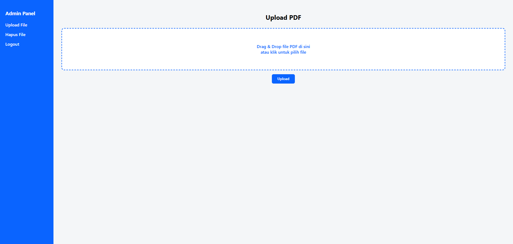

# PDF Viewer MySQL PHP

Aplikasi ini digunakan untuk mengunggah dan menampilkan file PDF yang tersimpan di MySQL menggunakan PHP.

## Preview Tampilan

### 📄 Tampilan 1

### 📄 Tampilan 2

### 📄 Tampilan 3

### 📄 Tampilan 4

